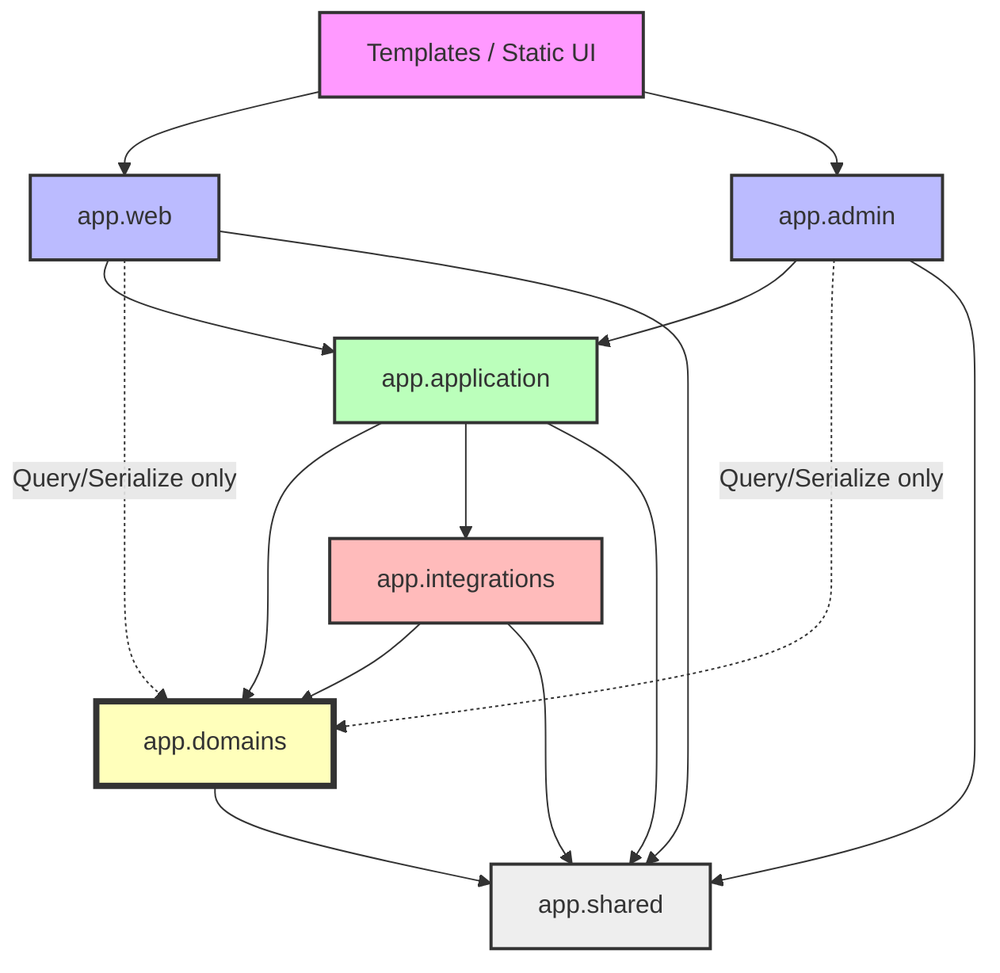

# Dependency Rules

This document defines the strict dependency graph and import rules for Nexora. Ensuring a clean dependency tree is vital for preventing circular imports, maintaining decoupling, and preserving architectural boundaries.

## Allowed Dependency Graph

The following diagram illustrates the high-level dependency flow of the system. Arrows indicate the direction of the dependency (`A --> B` means `A` imports/depends on `B`).

*(Note: Dotted lines indicate a restricted dependency, where the outer layer is only allowed to use a subset of the inner layer's capabilities).*

---

## Layer Dependency Rules

### 1. Presentation Layers (`app/web`, `app/admin`)
These layers act as the entry points for HTTP requests.
*   **MAY IMPORT:**
    *   `app.application` (to invoke workflows)
    *   `app.domains` (RESTRICTED: Only for invoking read-only `query_service` functions or `serializers`. State mutation must go through `app.application`).
    *   `app.shared`
*   **MUST NEVER IMPORT:**
    *   `app.integrations` (Integrations should run via tasks or application workflows)
    *   Each other. `app.web` must never import `app.admin`, and vice versa.

### 2. Application Layer (`app/application`)
The orchestrator of cross-domain workflows.
*   **MAY IMPORT:**
    *   `app.domains` (Full access to all services, models, and repositories).
    *   `app.integrations` (To orchestrate fetch or sync jobs).
    *   `app.shared`
*   **MUST NEVER IMPORT:**
    *   `app.web` or `app.admin`. Application workflows must remain entirely unaware of the HTTP context, request objects, or Flask blueprints.

### 3. Domain Layer (`app/domains`)
The core business logic.
*   **MAY IMPORT:**
    *   `app.shared`
    *   `app.infrastructure` (e.g., Cache decorators, DB sessions).
*   **MUST NEVER IMPORT:**
    *   `app.application`, `app.web`, `app.admin`, `app.integrations`.
*   **Cross-Domain Rules:** A domain (e.g., `domains/content`) should minimize importing from another domain (e.g., `domains/interaction`). Direct domain-to-domain imports are permitted *only* for simple references (e.g., a ForeignKey constraint) or lightweight data reads. If Domain A needs to trigger business logic in Domain B, that logic must be extracted to an `app.application` workflow.

### 4. Integrations Layer (`app/integrations`)
The boundary to the outside world.
*   **MAY IMPORT:**
    *   `app.domains` (To map external data to internal models and use domain services for persistence).
    *   `app.shared`
*   **MUST NEVER IMPORT:**
    *   `app.web`, `app.admin`.
    *   `app.application` (Avoid circular dependencies; the application layer should call integrations, not the other way around. Background scheduler entrypoints are the only exception).

### 5. Shared Layer (`app/shared`)
The universal utilities.
*   **MAY IMPORT:** Standard Python libraries and generic 3rd-party packages (e.g., `datetime`, `pydantic`).
*   **MUST NEVER IMPORT:**
    *   `app.domains`, `app.application`, `app.integrations`, `app.web`, `app.admin`. (If `shared` depends on a domain, it is no longer shared).

---

## Circular Dependency Rules

A circular dependency occurs when Module A imports Module B, and Module B imports Module A (directly or indirectly).

1.  **Strict Prohibition:** Circular dependencies are completely forbidden. They prevent the application from starting and signify architectural flaws.
2.  **Resolution Strategy:** If you encounter a circular dependency, you are likely violating the layer rules. To resolve it:
    *   **Extract:** Move the shared logic into a lower-level module (like `app.shared`).
    *   **Elevate:** Move the orchestration logic to a higher-level module (like `app.application`).
    *   **Invert:** Use Dependency Inversion (passing interfaces/callables rather than concrete modules).

---

## Service Interaction Rules

*   **Application Services to Domain Services:** An application service (e.g., `get_content_page.py`) imports multiple domain services (e.g., `content_access.py`, `recommendation/items.py`). The domain services remain oblivious to the application service.
*   **Domain Services to Domain Services:** Strictly limit interactions. If saving an Item requires creating a Taxonomy Tag, the `item` service may call the `taxonomy` service. However, if the process involves multiple domains, create an `ItemIngestionWorkflow` in the Application layer to manage the interactions sequentially.

---

## Serializer Dependency Rules

Serializers bridge the gap between rich ORM objects and presentation dictionaries.

*   **Allowed Imports:**
    *   Local domain models.
    *   Other domain serializers (e.g., `ArticleSerializer` may import `UserSerializer` to serialize the author).
*   **Prohibited Imports:**
    *   `app.web` or `app.admin`. Serializers must not format data for a specific HTML layout. They output raw, semantic dictionaries.
    *   HTTP Contexts: Serializers must not depend on Flask's `request` object.

---

## UI Dependency Rules

Dependencies exist within the frontend as well.

### Templates (`templates/`)
*   **Web Templates** must never include or extend **Admin Templates**.
*   **Admin Templates** must never include or extend **Web Templates**.
*   **Shared Partials:** If a component is identical in both, it must be placed in a generic `templates/components/` directory accessible to both.

### Static Assets (`static/`)
*   CSS and JavaScript are namespaced.
*   `static/css/admin` must not import from `static/css/web`.
*   If CSS/JS variables or components are shared, they must reside in `static/css/core` or `static/js/core`.
