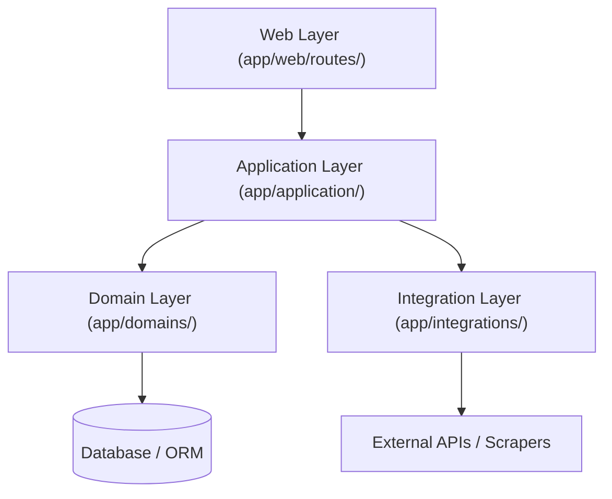

# Nexora System Architecture & Reference Guide

This document defines the authoritative architectural reference, standards, and conventions for Nexora. All future developers and AI assistants must align with these guidelines to maintain a clean separation of concerns, optimize queries, and prevent logic duplication.

---

## 1. Architectural Layers & Responsibilities

Nexora follows a **Layered Domain-Driven Design (DDD)** pattern. Dependencies must strictly flow one-way: **Web Layer → Application Layer → Domain Layer / Integration Layer**.



### A. Web Layer (`app/web/routes/`)
Handles HTTP protocol adapters. It keeps routing logic thin and delegates execution to the Application Layer.
* **Key Responsibilities**:
  * Parsing HTTP requests, route parameters, search terms, and active filters.
  * Form validation, flash messages, and user authentication checks (`current_user`).
  * Coordinating transaction boundaries by calling `db.session.commit()` on successful write execution.
  * Exception mapping, logging, and rendering responses (`render_template` or `jsonify`).
* **Strict Rules**:
  * **No raw queries or filters**: Never write SQLAlchemy joins or filter clauses inside routes.
  * **No business orchestration**: Do not construct multi-step business logic inside route functions.
  * **Thin endpoints**: Routes should remain under 30 lines of code.

### B. Application Layer (`app/application/`)
Acts as the workflow orchestrator. It executes use cases by coordinating domain queries, mutation services, and external integrations.
* **Key Responsibilities**:
  * Assembling composite payloads required by specific page views (e.g., loading an item details page alongside its related items, categories, and editorial reviews).
  * Enforcing orchestrator-level caching boundaries (`@cache.memoize` or `@cache.cached`).
  * Running background task orchestration and content ingestion/enrichment pipelines.
* **Location Conventions**:
  * General orchestrators: `app/application/<domain>/<use_case>.py` (e.g., [get_item_page.py](file:///app/application/item/get_item_page.py)).
  * Workflows: `app/application/<domain>/workflows/` (e.g., ingestion and enrichment scripts).

### C. Domain Layer (`app/domains/`)
Encapsulates business models, rules, database queries, commands, and normalization logic. It is completely isolated from HTTP frameworks.
* **Key Responsibilities**:
  * Defining DB models and relationships (`models.py`).
  * Composing SQLAlchemy 2.0 select statements (`service/query.py`).
  * Enforcing data mutation commands (`service/command.py`).
  * Formatting models into uniform dictionary APIs (`service/serializers.py`).
  * Defining eager loading option profiles (`service/options.py`).
* **Strict Rules**:
  * **Framework Independent**: Never import Flask variables (`request`, `session`, `g`) inside domain services.

### D. Integration Layer (`app/integrations/`)
Provides external transport adapters (scraping, API clients).
* **Key Responsibilities**:
  * Network requests and third-party data serialization.
  * Parsing RSS feeds, scrapers, and merchant catalogs.
* **Strict Rules**:
  * **No database state**: Integrations must return clean raw data structures (e.g., dicts/lists) and must not interact with database models.

---

## 2. Shared Code Conventions & Standards

To ensure code consistency, Nexora enforces the following implementation conventions.

### A. Database Session Injection Pattern (`session=None`)
To support scoped testing, nested transaction boundaries, and generic caller utility, all query/command methods must follow a strict database session convention:

1. **Parameter Ordering**: The `session` parameter must always be the **last optional parameter** (defaulting to `None`). Specific search identifiers, page numbers, or limits must come first.
   * **CORRECT**:
     ```python
     def get_item_by_id(item_id, serialize=False, load="detail", session=None):
     ```
   * **INCORRECT** (Avoid the legacy Content domain pattern):
     ```python
     def get_content_by_id(session=None, content_id=None):  # Bad ordering
     ```
2. **Session Resolution**: Functions must check if `session is None` and fall back to the global `db.session`:
   ```python
   if session is None:
       from app.core.extensions import db
       session = db.session
   ```
   This ensures that callers in Application / Web layers can omit the parameter entirely, keeping calls concise: `get_item_by_id(123)`.

### B. Query Composition & Eager Loading Options
To optimize performance and avoid the N+1 query problem, all reads must utilize SQLAlchemy 2.0 select statements and explicit eager loading profiles:

1. **Statement Builders**: Avoid calling `select(Model)` directly in multiple queries. Use centralized statement builders in `service/utils.py` that apply standard configuration options:
   ```python
   def build_item_stmt(eager_load="card"):
       stmt = select(Item)
       loads = get_item_load_options(eager_load)
       if loads:
           stmt = stmt.options(*loads)
       return stmt
   ```
2. **Load Profiles**: Define profiles (e.g., `"minimal"`, `"card"`, `"detail"`) inside `service/options.py` using `joinedload`, `selectinload`, or `subqueryload`.
3. **Execution Separation**: Return query results via execution helpers:
   ```python
   def fetch_items(stmt, session=None):
       # ... executes session.execute(stmt).scalars().all()
   ```

### C. Model Static Methods vs. Domain Services
* **Model Static Methods** (e.g., `Topic.get_or_create(name, session)` or `Section.get_by_slug(slug, session)`): Reserved **strictly** for simple, single-entity lookups or creation utilities during ingestion.
* **Domain Service Queries** (e.g., `get_filtered_items`): Must be used for any complex querying, ordering, joining, paging, or serialization formatting. Do not overload database model files with advanced query logic.

### D. Serialization Conventions
To keep HTML templates simple and prevent lazy-loading database errors:
1. **Polymorphic Serialization**: Use `serialize_target(obj)` in [serializers.py](file:///app/domains/serializers.py) to unify polymorphic structures (e.g., Article, Video, Post, Item) into a predictable dictionary structure.
2. **Domain-Specific Serializers**: Place serializers in `domains/<domain>/service/serializers.py` (e.g., `serialize_item` or `serialize_item_detail`).
3. **Template Payload rule**: Views/templates must receive pre-serialized dictionaries rather than raw database model objects, preventing accidental database calls during template rendering.

### E. Caching Standards
* **Caching Boundaries**: Caching decorators (`@cache.memoize` or `@cache.cached`) must live strictly at the **Application orchestrator** level or **Domain Query Service** boundary.
* **No Route-Level Caching**: Do not cache Flask route endpoints directly. This leaves the Web Layer dynamic for session validation, flash notifications, and request headers.

### F. Exception Handling & Logging
1. **Web Logging**: Routes must log request status using the shared logging helpers (`log_route_start`, `log_route_success`, `log_route_error`):
   ```python
   try:
       log_route_start(logger, f"/contents/{content_id}")
       # ... execution logic ...
       log_route_success(logger, f"/contents/{content_id}", template="page.html")
   except Exception as e:
       log_route_error(logger, f"/contents/{content_id}", e)
       raise
   ```
2. **Propagation**: Lower layers (Domain/Integration) must raise descriptive exceptions instead of silently catching them, allowing the Web Layer to control error rendering (e.g., `abort(404)` or fallback messages).
