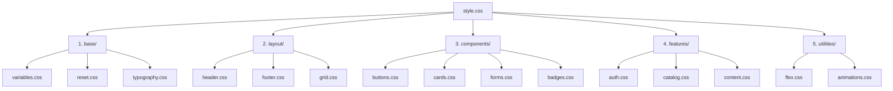

# CSS Audit & Structural Analysis Report

This document presents the results of the cross-audit between the `style.cleaned.css` monolith and the frontend template inventory.

## 1. Audit Statistics

| Category | Count | Description |
| :--- | :--- | :--- |
| **Total Unique Selectors** | 912 | Distinct selectors analyzed in the CSS file. |
| **Directly Matched (Used)** | 709 | Found in HTML templates via class/ID mapping. |
| **Unmatched (Potential Dead Code)** | 203 | Not found in templates (includes dynamic states). |

> [!NOTE]
> Many "Unused" selectors are actually dynamic state classes (e.g., `.is-active`, `.is-loading`, `.checked`) applied via JavaScript or backend conditional logic. These are marked as **Dynamic Candidates**.

## 2. Usage Categorization

### ✅ Active Core Components
These are the most heavily used and critical selectors:
- **Layout**: `.site-header`, `.site-footer`, `.container`, `.listing-layout`
- **Cards**: `.card`, `.card--compact`, `.card__title`, `.card__img-wrapper`
- **UI Elements**: `.btn`, `.badge`, `.input`, `.filter-item`
- **Detail Pages**: `.detail-page`, `.detail-page__main`, `.item-gallery`

### ⚠️ Dynamic Candidates (Likely Used)
These were not found in static HTML but are essential for interactivity:
- `.is-loading`, `.is-active`, `.is-open`, `.is-visible`
- `.checked`, `.checked::after` (Custom checkboxes)
- `.pagination__page.is-active`
- `.nav-user.active`

### 🔍 Potential Dead Code / Orphaned Styles
These selectors should be double-checked before the next phase:
- `.animate-float` (No usage found)
- `.card--info` (Generic variant)
- `.footer-social.facebook:hover` (Specific brand overrides)
- `.pyramid-layer--top` (Niche perfume detail styles)
- `.sidebar-accent--articles` (Specific color overrides)

## 3. Duplicate & Redundancy Patterns

The audit identified several areas where CSS variables could further consolidate the code:
- **Color Themes**: Many components repeat HSL/RGB logic for "Blue", "Green", and "Purple" themes (e.g., `.footer-title--blue`, `.detail-page--article`).
- **Spacing**: Hardcoded padding/margins in `.card__content` and `.item-details-card` should be tokenized.
- **Shadows**: `.auth-wrapper` and `.item-details-card` use similar but slightly different shadow definitions.

## 4. Proposed Modular Structure

To facilitate deterministic refactoring, the following 7-module structure is proposed:

## 5. Next Steps

1. **Deterministic Splitting**: Use a script to split the monolith into the proposed files based on the selector categorization.
2. **Variable Injection**: Replace repeated hex/rgb values with contextual variables (e.g., `--theme-primary`).
3. **Dead Code Elimination**: Safely remove confirmed orphaned styles identified in this audit.
